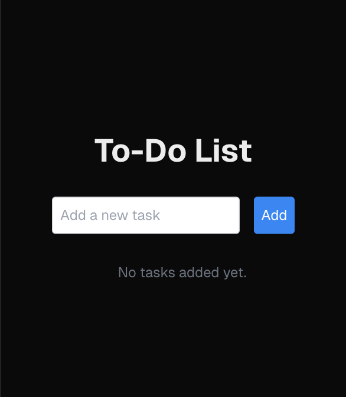

<a id="readme-top"></a>

<!-- PROJECT LOGO -->
<br />
<div align="center">
  <a href="https://github.com/francotechadmin/to-do-demo">
    
  </a>

<h3 align="center">To-do Pro</h3>
  <p align="center">
    An awesome project to manage your activities!
    <br />
    <a href="https://github.com/francotechadmin/to-do-demo"><strong>Explore the docs »</strong></a>
    <br />
    <br />
    <a href="https://github.com/francotechadmin/to-do-demo/issues/new?labels=bug&template=bug-report---.md">Report Bug</a>
    ·
    <a href="https://github.com/francotechadmin/to-do-demo/issues/new?labels=enhancement&template=feature-request---.md">Request Feature</a>
  </p>
</div>

<!-- TABLE OF CONTENTS -->
<details>
  <summary>Table of Contents</summary>
  <ol>
    <li>
      <a href="#about-the-project">About The Project</a>
      <ul>
        <li><a href="#built-with">Built With</a></li>
      </ul>
    </li>
    <li>
      <a href="#getting-started">Getting Started</a>
      <ul>
        <li><a href="#prerequisites">Prerequisites</a></li>
      </ul>
    </li>
    <li><a href="#usage">Usage</a></li>
    <li><a href="#roadmap">Roadmap</a></li>
    <li><a href="#contributing">Contributing</a></li>
    <li><a href="#license">License</a></li>
    <li><a href="#contact">Contact</a></li>
  </ol>
</details>

<!-- ABOUT THE PROJECT -->

## About The Project

<a href="https://main.ds5im9z8tc6j1.amplifyapp.com/" target="\_blank">
    
</a>

To-Do Pro is a sleek, user-friendly app designed to help you stay organized, track your tasks, and boost your productivity. Its modern UI ensures a seamless experience across devices. Whether you’re managing daily errands or complex projects, To-Do Pro has got you covered.

<p align="right">(<a href="#readme-top">back to top</a>)</p>

## Built With

- [![Next][Next.js]][Next-url]
- [![React][React]][React-url]
- [![Tailwind CSS][Tailwind]][Tailwind-url]
- [![GraphQL][GraphQL]][GraphQL-url]
- [![Amplify][Amplify]][Amplify-url]

<p align="right">(<a href="#readme-top">back to top</a>)</p>

<!-- GETTING STARTED -->

## Getting Started

To get started with To-Do Pro, follow these instructions to set up the project locally.

### Prerequisites

- Node.js
- npm
- AWS account
- Amplify CLI

1. Clone the repo

```sh
git clone
```

2. Install NPM packages

```sh
npm install
```

3. Set up Amplify

```sh
amplify init
```

4. Add the API

```sh
amplify add api
```

5. Push the changes

```sh
amplify push
```

6. Start the development server

```sh
npm run dev
```

<p align="right">(<a href="#readme-top">back to top</a>)</p>

<!-- USAGE EXAMPLES -->

## Usage

Landing Page: Navigate to the homepage to learn about the app and access the features.

To-Do Manager: Add, edit, delete, and organize your tasks effortlessly.
Mobile-Friendly: Access the app on the go from any device.

<p align="right">(<a href="#readme-top">back to top</a>)</p>

<!-- ROADMAP -->

## Roadmap

- [ ] Add task prioritization
- [ ] Implement drag-and-drop task reordering
- [ ] Add due dates and reminders
- [ ] Real-time collaboration for shared lists
- [ ] Offline functionality with data syncing
- [ ] Multi-language support
- [ ] See the open issues for a full list of proposed features (and known issues).

<p align="right">(<a href="#readme-top">back to top</a>)</p>

<!-- CONTRIBUTING -->

## Contributing

Contributions are always welcome! Here’s how you can help:

Fork the repository
Create your feature branch (git checkout -b feature/amazing-feature)
Commit your changes (git commit -m 'Add an amazing feature')
Push to the branch (git push origin feature/amazing-feature)
Open a pull request

<p align="right">(<a href="#readme-top">back to top</a>)</p>

<!-- LICENSE -->

## License

Distributed under the MIT License. See LICENSE for more information.

<p align="right">(<a href="#readme-top">back to top</a>)</p>

<!-- CONTACT -->

## Contact

Gabriel Franco - francotechnlogiesllc@gmail.com

Project Link: https://github.com/francotechadmin/to-do-demo

<p align="right">(<a href="#readme-top">back to top</a>)</p>

<!-- MARKDOWN LINKS & IMAGES -->

[screenshot]: public/sc.png
[Next.js]: https://img.shields.io/badge/Next.js-000000?style=for-the-badge&logo=next.js&logoColor=white
[Next-url]: https://nextjs.org/
[React]: https://img.shields.io/badge/React-20232A?style=for-the-badge&logo=react&logoColor=61DAFB
[React-url]: https://reactjs.org/
[Tailwind-url]: https://tailwindcss.com/
[Tailwind]: https://img.shields.io/badge/Tailwind_CSS-38B2AC?style=for-the-badge&logo=tailwind-css&logoColor=white
[GraphQL]: https://img.shields.io/badge/GraphQL-E10098?style=for-the-badge&logo=graphql&logoColor=white
[GraphQL-url]: https://graphql.org/
[Amplify]: https://img.shields.io/badge/Amplify-FF9900?style=for-the-badge&logo=AWS-Amplify&logoColor=white
[Amplify-url]: https://aws.amazon.com/amplify/
